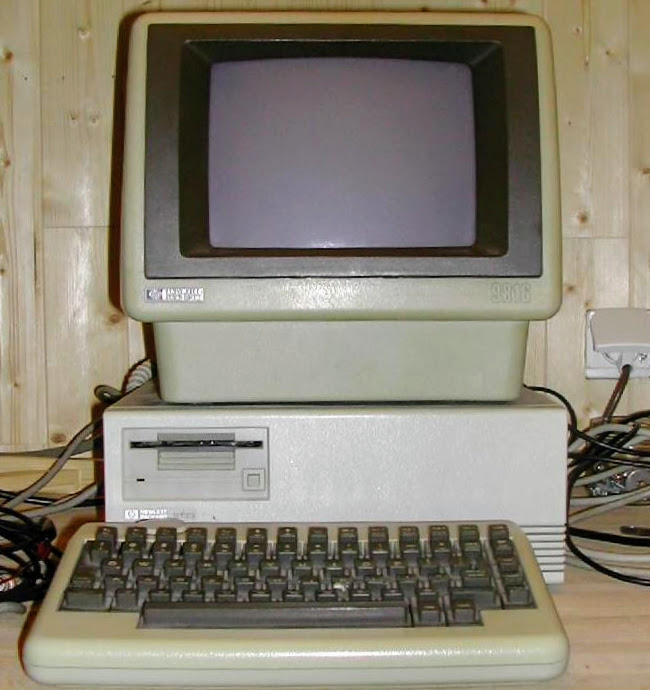

# hp9816emu an HP9816 Emulator for Linux

This is an emulator for the HP9816 desktop workstation that was based on an 8MHz Motorola 68000 processor. It was released in 1982 and was the first affordable computational workstation with three progamming environments: Basic, HPL and Pascal.



The code was adapted from Olivier de Smet's 98x6 emulator for windows. See his 
 [Website](https://sites.google.com/site/olivier2smet2/hp_projects/hp98x6).

License: GPL V3


## Prerequisites

The UI graphics is implemented using Maorong Zou's
[EZWGL](https://github.com/dpenkler/EZWGL) library which must be
installed before building hp9816emu.

## Installation


```
$ git clone https://github.com/dpenkler/hp9816emu.git hp9816emu

$ cd hp9816emu/src

$ make


```

## Running the emulator

```
$ cd <path to hp9816emu directory>
$ ./hp9816emu

```

Press the **Run** button

Load a disk image (e.g. Press on the 7908  **Unit 0** label in the right hand panel
and load the dmpas.hpi disk image)


## Features

The following HPIB peripherals are preconfigured on select code 7 and cannot be changed:

- 700: hp9121 amigo floppy disk drive units 0 and 1
  -  This is mainly for the HPL2 operating system.
  -  HPL2 boots from it but then hangs. (Workaround: boot HPL from ss/80 drive)
  -  Basic and Pascal OK.
- 701: printer - prints to file on host local file system:
               printer-xxx.txt
- 702: hp9122 ss/80 floppy disk drive units 0 and 1
- 703: hp7908/7911/7912 cs/80 hard drive unit 0
- 704: hp7908/7911/7912 cs/80 hard drive unit 0

When a **Unit N** label is clicked a menu to manage the corresponding disk image is posted.

## Files

####  Disk Image Files

When the emulator is **Run** initially it executes the boot rom which
will search for an operating system to boot from the disks after a
lengthy memory test. To associate a disk image with a drive click on
the drive icon **Unit N** corresponding to the drive model you have an image
for and load the appropriate disk image. Disk image files have the
.hpi suffix and can be created using Ansgar Kuekes'
[hpdir](https://hp9845.net/9845/projects/hpdir/) utility. For example to create a disk image for a 7911 drive:

```
$# hpdir -initialize -lif -<drive-type> -n <lif-label> <image-file-name>
$ hpdir -initialize -lif -7911 -n 7911V1 7911V1.hpi
```

The [HP Museum](http://hpmuseum.net/exhibit.php?swc=6) has lots of
images in TD0 format. See Ansgar's
[Teledisk-to-hpi](https://www.hp9845.net/9845/projects/utilities/#ima2hpi)
utilities to convert them to hpi format.

A sample disk image file for a 7908 drive is provided in the repo:
dmpas.hpi You can load it by clicking on the 7908 **Unit 0** button on
the right hand panel.  It contains a number of operating systems.  By
default it will boot into Pascal 1P SYSTEM_P. Note the dmpas.hpi disk
image has been configured with 4 soft partitions. hpdir can only
access the first partition.

To boot another OS press any key while the boot Rom is running the
memory test.  When you see "SEARCHING FOR A SYSTEM (ENTER To Pause)"
type the two characters corresponding to the OS you want to boot:

```
 1P for Pascal
 2P for Pac-Man
 1O for Othello
 1H for HPL2
 1Z for Basic
```


####  System Image Files

It is possible to save the current running system in a system image file.

If a system image file is passed as a runtime argument or loaded via
the SystemImage menu the emulator loads and runs the image.  Note: All
files in use by the system when the image was created must still be
present at the same location (hpi files).

## Top bar menu

### Settings

The **Settings** button allows you to choose the memory size and whether
the floating point unit is enabled or not. These two settings only
take effect when initialising a **New** system image. Pascal programs
compiled with the `$FLOAT_HDW ON$` directive require the floating
point unit to be enabled.

There are 5 general settings: "Default filename for system image",
"Set system time", "Auto save system image", "Auto save on exit" and
"Phosphor".  The general settings take effect immediately.

The "Default filename for system image" is initially set to "system.img" and can be changed by entering another filename in the entry box. 
This filename is used when no filename is associated with the current system image when saving the system image:
* on **Quit** and "Auto save on exit" is enabled
* on **New** or **Load** and "Auto save system image" is enabled
The current filename associated with the system image is reflected in the emulator window title.

"Set system time" when enabled will automatically set the system time for Pascal and Basic OS's

"Auto save system image" when enabled will automatically save the
current image when loading a new image with **Load** or initialising a new image with **New**.

"Auto save on exit" when enabled will save the image on **Quit**. If no
image file has been loaded the default filename for the system image is used.

Be careful not to uninitentionally overwrite the default system image file when enabling the "Auto save" options. No confirmation questions will be asked.

The "Phosphor" setting changes the colour of the screen. Colour choices are: "White", "Green" and "Amber".

To hide the Settings menu just click on the **OK** button.

### Speed

The **Speed** button allows you to set the speed of the emulated
MC68000 clock.  Choices are 8, 16, 24, 32 MHz and Max. For games it
should be set to the standard 8MHz frequency. The effective CPU
frequency attained might slow down when interacting with the UI
elements since the X-Window system locks out the CPU emulation thread
during those times.

The speed setting takes effect immediately.

To hide the Speed menu without selecting a speed just click on the **Speed** button again.

### SystemImage

This menu's items are as follows:

* **New** creates a clean system image and reboots the system. (Reflected by "New system imgage" in the window title).
* **Load** an existing image and run it.
* **Save** the running system in the existing image (Reflected in the window title).
* **SaveAs** the running system in a file of your choice. If ok will be reflected in the window title.
* **Close** saves the image in the existing (or default) file and dissociates the file name from the running image (Reflected by "Untitled" in the window title).

To hide the SystemImage menu without doing anything just click on the **SystemImage** button again.

### Run button

The emulator is implemented using 2 threads. One for the main and UI functions and another to emulate the actual CPU. When the **Run** button is depressed (on) the CPU thread fetches and executes instructions and polls for I/O events. When the **Run** button is off the cpu thread goes into an idle loop.


### System status LED panel

The actual current CPU frequency and system memory size is shown in the panel. Note that CPU frequency is 0 when the emulator is not running.

### FPU Led

This LED is on when the FPU is enabled in the current system image

### Quit button

When pressed the emulator terminates. If the autosave on exit flag setting is enabled the current system image is saved . If the current system image was loaded from an existing image file that image file is updated otherwise it is saved into the default system image file.

## Right hand panel

The right hand panel provides a number of buttons and indicators.

## Buttons

Each **Unit N** button posts a menu to manage the association of a disk image (.hpi file) with the corresponding drive. Entries will be greyed out if they are not applicable. These buttons can only be used when the emulator is running as they are handled by the cpu thread. The button label colour is black when no disk is associated with the unit otherwise it is red. When the volume label on the disk is read by the operating system the button label changes to the LIF Volume name.

* **Load** Posts a file selection widget to choose the file to associate with the drive
* **Save** Save the disk image back to the file from whence it came (floppies only)
* **Eject** Disassociates the disk image from the drive
* **Cancel** Hides the menu without doing anything

There is no RESET button on the keyboard. Click on the red button at the bottom of the right hand panel to reset the emulator. The system is reset immediately and any work in progress is lost and changed settings are not taken into account.

## Indicators

On the right hand panel there are 10 indicators

The indicators in front of the different drive address labels Addr:70X are lit when the corresponding drive is "connected" to the HPIB bus.

The indicators in front of the **Unit N** buttons flash when there is activity on the drive unit

The **Unit N** button labels change to the LIF Volume label and light red when there is a disk image associated with the drive unit.

The Leds above the red graphics reset button represent the CPU Status LEDs on the back of the 9816 CPU board.

## Keyboard

   The HP9816 special keys are mapped to the US QWERTY keyboad as follows:

```
   UK Keyboard       HP9816 Key
   -------------     ----------
   [Escape]        = Clear I/O
   [Shft]+[Escape] = STOP
   \               = Execute
   |               = Shift Execute
   [Enter]         = Enter
   [Alt]+[Enter]   = Execute
   [Alt]+ ~        = Step
   [Home]          = Clear to end
   [Alt]+[Home]    = Recall
   [Up]            = Up
   [Alt]+[Up]      = Alpha 
   [Down]          = Down
   [Alt]+[Down]    = Graphics
   [Left]          = Left
   [Alt]+[Left]    = Pause
   [Right]         = Right
   [Alt]+[Right]   = Continue
   [Pg Up]         = Shift up
   [Alt]+[PG Up]   = Result
   [Pg Dn]         = Shift down
   [Alt]+[Pg Dn]   = Edit
   [Ins]           = Insert char
   [Alt]+[Ins]     = Insert line
   [Del]           = Delete char
   [Alt]+[Del]     = Delte line
```

For HPL }  = Right arrow symbol (assignment)

The mappings are defined in keyboard.c

## Knob

The knob is emulated by the mouse wheel. Unshifted moves horizontally, shifted moves vertically.

## Resources

For history, documentation and software for the 9816 see the wonderful [HP Comupter Museum](http://www.hpmuseum.net/display_item.php?hw=4)
maintained by the wizards of Oz.

## Issues and enhancement requests

Use the [Issue](https://github.com/dpenkler/hp9816emu/issues) feature in github to post requests for enhancements or bugfixes.
